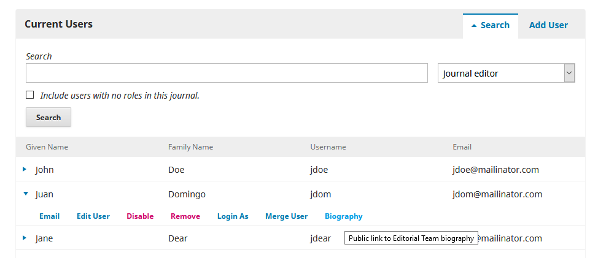

# EditorialBio plugin for PKP

This plugin exposes the editorial biographies as pages, as used to be the case with OJS 2.x.

## Requirements

* OJS 3.4 / OMP 3.4 or later
* PHP 8.0 or later

## Installation

Install this as a "generic" plugin. The preferred installation method is through the Plugin Gallery.

To install manually via the filesystem, extract the contents of this archive to an "editorialBio" directory under "plugins/generic" in your OJS root.  To install via Git submodule, target that same directory path: `git submodule add https://github.com/ulsdevteam/pkp-editorialBio plugins/generic/editorialBio`.  Run the plugin install script to register this plugin, e.g.: `php lib/pkp/tools/installPluginVersion.php plugins/generic/editorialBio/version.xml`, or run the upgrade script, e.g.: `php tools/upgrade.php upgrade`

## Configuration

No configuration is needed.  Just enable and go!

## Usage

The endpoint *journal_path*/about/editorialTeamBio/*user_id* will respond to display a public editorial bio page, if data is entered in the biography for an editor or journal manager.  To find the path, browse to the user's profile in the Users List to find a reference to the link. E.g.:

## Author / License

Written by Clinton Graham and Tazio Polanco for the [University of Pittsburgh](http://www.pitt.edu).  Copyright (c) University of Pittsburgh.

Released under a license of GPL v2 or later.
